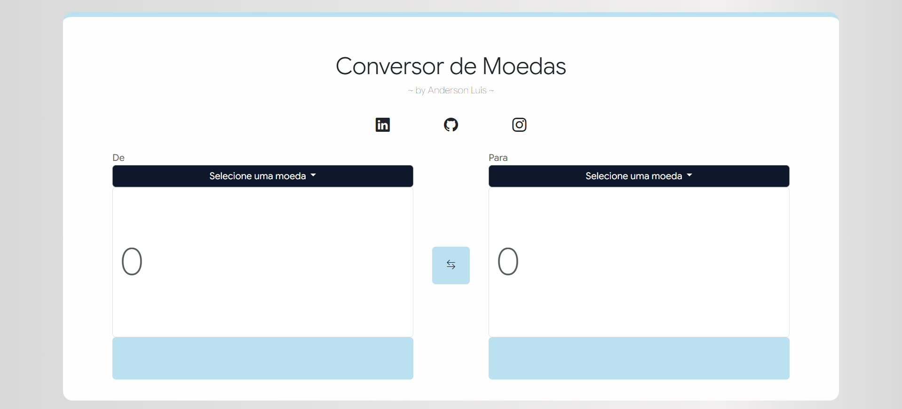
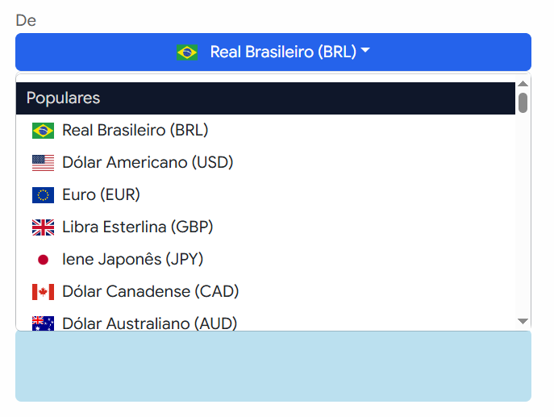
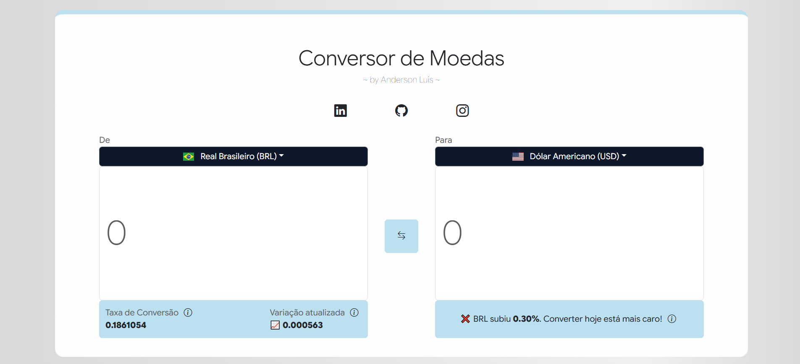
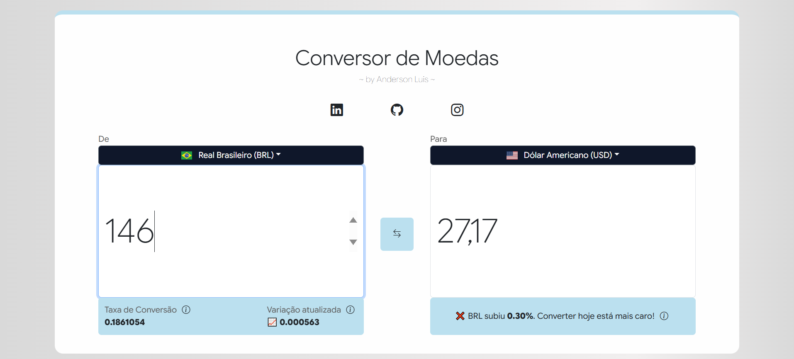
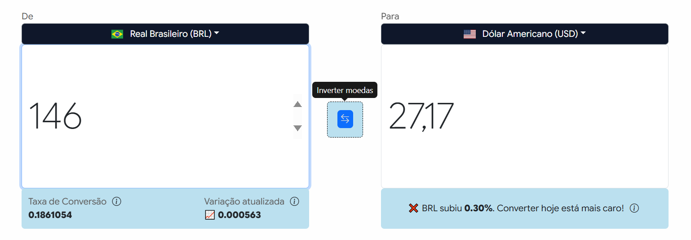
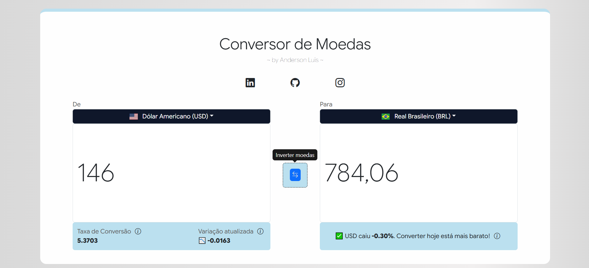

# 💱 Conversor de Moedas 💱

* **Conversor de Moedas** é uma aplicação web desenvolvida como projeto pessoal full-stack, com o objetivo de permitir a conversão entre diferentes moedas em tempo real, consumindo a API pública da [AwesomeAPI](https://docs.awesomeapi.com.br/api-de-moedas).

* **Currency Converter** is a personal full-stack web application designed to convert between different currencies in near real time, using the public [AwesomeAPI](https://docs.awesomeapi.com.br/api-de-moedas) exchange rates API.

* O foco do projeto é unir boa experiência de usuário, responsividade e organização de código, utilizando Node.js no backend e uma interface moderna no frontend.

* The project focuses on combining good user experience, responsiveness, and clean code organization, using Node.js on the backend and a modern frontend interface.








---

## 🔧 Tecnologias Utilizadas / Tools & Technologies

### Frontend
- **HTML5**
- **CSS3 + Bootstrap 5**
- **Media Queries**
- **JavaScript (ES6+)**
- **EJS (templates dinâmicos)**

### Backend
- **Node.js**  
- **Express.js** 
- **Axios** (consumo da API de câmbio / exchange rate API consumption)

### Outros / Others
- **Trello** (organização de funcionalidades no estilo Kanban / organization of features in a Kanban style)

## 📂 Estrutura do Projeto / Project Structure

```bash
conversor-de-moedas/
├─ public/                     # Arquivos estáticos / Static files
│  ├─ css/                     # Estilos separados por responsabilidade / Styles split by responsibility
│  ├─ js/                      # Scripts do frontend / Frontend scripts
│  └─ images/                  # Ícones e imagens / Icons and images
├─ views/                      # Templates EJS / EJS templates
│  ├─ layouts/                 # Layout principal / Main layout
│  ├─ pages/                   # Páginas / Pages
│  ├─ partials/                # Componentes reutilizáveis / Reusable components  
│  └─ index.ejs                # Arquivo fonte EJS / EJS Source file
├─ index.js                    # Arquivo principal do servidor / Main server file
├─ package.json                # Dependências e scripts / Dependencies and scripts
├─ package-lock.json           # Lockfile do npm / NPM lockfile
├─ .gitignore                  # Arquivos ignorados pelo Git / Git ignored files
└─ README.md                   # Documentação / Project documentation
```          

## ⚙️ Decisões de Design / Design Decisions

* **Node.js + Express:** Escolhidos pela simplicidade, rapidez na criação de rotas e facilidade de integração com APIs externas. Chosen for simplicity, fast route creation, and easy integration with external APIs.

* **EJS com partials:** Utilizado para manter o código HTML organizado, reutilizável e mais fácil de manter. Used to keep HTML code organized, reusable, and easier to maintain.

* **Axios no backend:** Facilita o tratamento de erros e a comunicação com a API de câmbio. Makes error handling and API communication easier.

* **Bootstrap 5:** Garante uma base sólida de responsividade e componentes prontos, acelerando o desenvolvimento da interface. Provides a solid responsive foundation and ready-to-use components.

* **Separação de responsabilidades no CSS:** Os estilos foram divididos em arquivos menores (layout, componentes, utilidades e responsividade), facilitando manutenção e escalabilidade. CSS is split into smaller files (layout, components, utilities, responsiveness) for easier maintenance and scalability.

## 🌟 Funcionalidades Principais & Futuras / Key Features & Future Work

### 1. Funcionalidades principais / Key Features

* **Conversão entre moedas:** Permite converter valores entre diferentes moedas utilizando a taxa mais recente disponível. Convert values between different currencies using the latest available exchange rate.

* **Exibição de taxa e variação:** Mostra a taxa de conversão atual e a variação do preço em relação à cotação anterior. Displays the current exchange rate and its variation compared to the previous value.

* **Feedback visual contextual:** Indica se a moeda subiu, caiu ou se manteve estável, auxiliando na tomada de decisão do usuário. Shows whether the currency went up, down, or remained stable, helping user decisions.

* **Interface responsiva:** Funciona corretamente em desktops, tablets e dispositivos móveis. Fully responsive interface for desktop, tablet, and mobile devices.

* **Tratamento de erros:** Exibe mensagens amigáveis quando a cotação não está disponível ou a API retorna erro. Friendly error messages when exchange data is unavailable.

### 2. Funcionalidades Futuras / Future Features

* **Histórico de conversões:** Armazenar conversões recentes usando localStorage. Store recent conversions using localStorage.

* **Gráfico de variação:** Exibir a evolução da moeda ao longo do tempo. Display currency variation over time with charts.

* **Favoritos:** Permitir que o usuário salve pares de moedas mais usados. Allow users to save favorite currency pairs.

* **Modo escuro / Dark mode:** Alternância entre tema claro e escuro. Light and dark theme toggle.

## 🚀 Como rodar o projeto / How to run the project

```bash
# Clonar o repositório / Clone the repository
git clone https://github.com/seu-usuario/conversor-de-moedas.git
cd conversor-de-moedas

# Instalar dependências / Install dependencies
npm install

# Rodar o servidor / Start the server
node index.js
```

* O servidor estará disponível em: http://localhost:3000
* Access in the browser: http://localhost:3000

## ⏳ Andamento do projeto / Project progress

* **Trello:** https://trello.com/b/d5ogELIs/conversor-de-moedas
